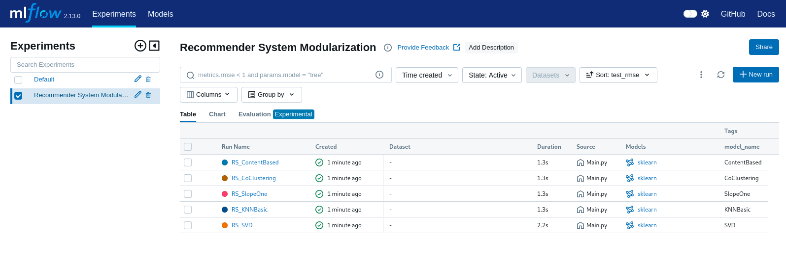
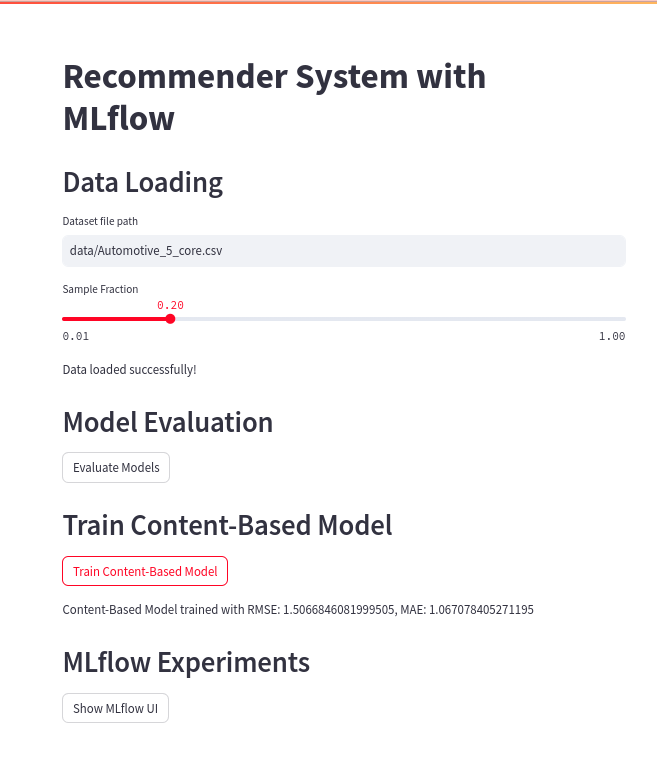

## Overview 

This project aims to develop a modular recommender system using multiple algorithms. It includes data loading and preprocessing, model training, and evaluation using various collaborative and content-based filtering techniques. Futher more, it includes a web app that allows users to interact with the recommender system.

Dataset downloaded from: [Amazon-reviews-2023](https://amazon-reviews-2023.github.io/index.html#)


## **Table of Contents**
- [Overview](#overview)
- [Project](#Project)
- [Setup](#Setup)
- [Usage](#Usage)
- [Models](#Models)
- [Evaluation](#Evaluation)

## Project

Project Structure

```bash 
recommender_system/
├── data/
│   └── datasets_amazon/
│       └── Automotive_5_core.csv
├── models/
│   ├── __init__.py
│   ├── recommender.py              # Models and Content-based recommender
│   ├── data_loader.py              # Data loading and preprocessing
│   └── evaluator.py                # Model evaluation
├── config/
│   └── config.yaml                 # Configuration file
├── streamlit_app/
│   └── app.py
├── main.py                         # Main script to run the project
├── pyproject.toml                  # Poetry configuration file
├── README.md                       # Project documentation
└── mlflow.db                       # MLflow tracking database
```


## Setup


1- Clone Repository:

```bash 
git clone https://github.com/cristianBMJ/Recommendation_System_MLflow.git
cd Recommendation_System_MLflow
```

2- Install Poetry if you don't have it:

```bash
curl -sSL https://install.python-poetry.org | python3 -
```

3- Install the dependencies:

```bash
poetry install
```

4- Activate the virtual environment:

```bash
poetry shell
```


## Usage

### Run the Tracking Server

Run the MLflow tracking server using the following command:

```bash
mlflow server --backend-store-uri sqlite:///mlflow.db --default-artifact-root ./artifacts
```

### Run  

Run the main script to load data, train models, and evaluate their performance:

```bash
python Main.py
```



### Run Data Web apps with Streamlit

Run the app.py script from folder `streamlip_app`:

```bash
export PYTHONPATH=$(pwd)
streamlit run streamlit_app/app.py
```



## Models

This project implements the following recommendation algorithms:

SVD (Singular Value Decomposition),
KNNBasic (k-Nearest Neighbors),
SlopeOne,
CoClustering. Additionally, a content-based recommender system is included.

## Evaluation

Model performance is evaluated using the functions provided in models/evaluator.py. The results are printed to the console and can be tracked using MLflow.

## Troubleshooting
